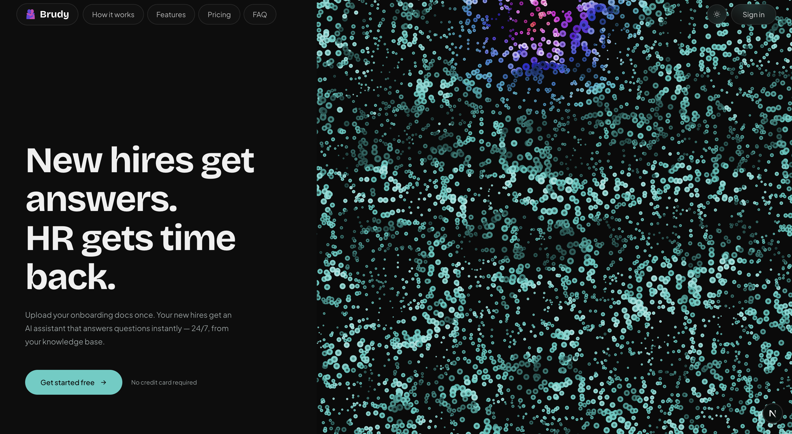
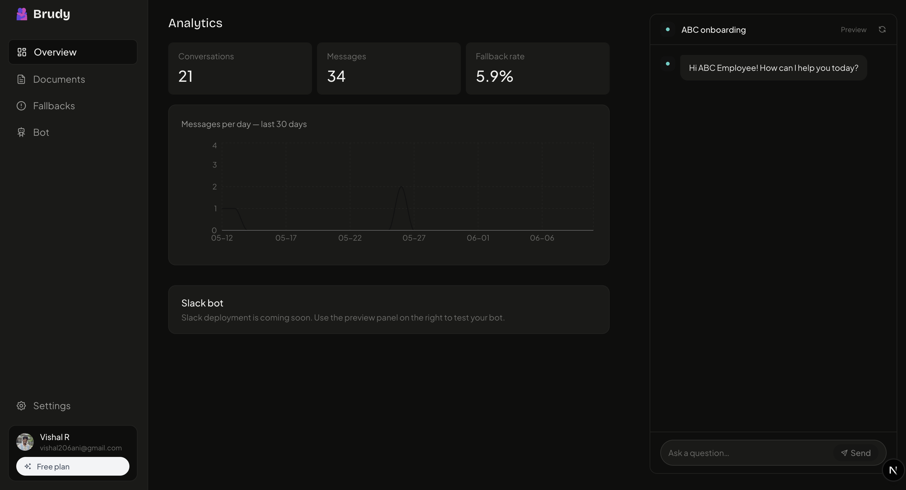

  

  <h1>Brudy</h1>

  
HR uploads their docs once. Anyone on the team gets answers instantly — 24/7, no digging required.

  

    
    
    
    
    
    
    
    
  

 

---

When I joined the company, I had an induction session which covered everything I had to know. After a week, I had some questions. After a month, I had some questions. Even after one year, I had some questions.

Mostly, I hit up my teammates or tracked down an HR. I saw new joiners after me — and my seniors — had the same questions. When a policy changed, people had questions. When a policy was removed, people had questions. Most of the time, the whole team had no answer.

We all knew it was documented somewhere, and no one had time to find it.

Turns out, this is exactly the kind of problem AI is built for. Still, I couldn't find a product my company or any other could use. So I built Brudy — a simple space where HR uploads their documents and anyone on the team can ask questions and get accurate answers, instantly.

---

## How It Works

<table>
<tr>
<td width="50%" valign="top">

**For HR**

- Upload onboarding docs, handbooks, and SOPs
- Configure the bot's name, tone, and fallback message
- Share a public chat link — no account needed for employees
- Track usage and see what questions come up most

</td>
<td width="50%" valign="top">

**Under the hood**

- Documents are parsed, chunked, and embedded via OpenAI
- Embeddings stored in pgvector for semantic similarity search
- RAG pipeline retrieves the most relevant chunks per query
- Responses include source citations and graceful fallbacks

</td>
</tr>
</table>

---

## Tech Stack

| Layer            | Technology                           |
| ---------------- | ------------------------------------ |
| Frontend         | Next.js 14, Tailwind CSS, TypeScript |
| Auth             | Clerk                                |
| Backend          | Python, FastAPI                      |
| Database         | PostgreSQL 17 + pgvector (Railway)   |
| File Storage     | Cloudflare R2                        |
| AI               | OpenAI API                           |
| Analytics        | PostHog                              |
| Payments         | Stripe                               |
| Frontend Hosting | Vercel                               |
| Backend Hosting  | Railway                              |

---

## Build Progress

**Infrastructure**

- [x] Next.js frontend + FastAPI backend
- [x] Clerk authentication (signup, login, logout)
- [x] PostgreSQL 17 + pgvector on Railway
- [x] Cloudflare R2 file storage
- [x] Deployed to Vercel + Railway

**Document Pipeline**

- [x] Document upload, list, delete
- [x] Async document processing with background tasks
- [x] Text parsing and chunking (tiktoken)
- [x] OpenAI embeddings stored in pgvector

**AI Chat**

- [x] RAG query pipeline with pgvector similarity search
- [x] OpenAI text generation with streaming
- [x] Source citations in responses
- [x] Fallback handling for low-confidence answers
- [x] Message persistence across sessions

**HR Dashboard**

- [x] Bot configuration (name, personality, fallback message)
- [x] Shareable public chat link
- [x] Usage metrics
- [x] PostHog analytics integration

**Billing**

- [x] Stripe checkout + customer portal
- [x] Usage limits with upgrade prompts
- [x] Pricing page (Free / Starter / Growth / Scale)

**In Progress**

- [ ] Slack / Teams bot integration

---

## Docs

| Doc                                  | What's inside                                                 |
| ------------------------------------ | ------------------------------------------------------------- |
| [Architecture](docs/Architecture.md) | System design, how services connect, why each tech was chosen |
| [Auth](docs/Auth.md)                 | Clerk setup, middleware, token flow                           |
| [Database](docs/Database.md)         | Schema, pgvector, Alembic migrations                          |
| [Storage](docs/Storage.md)           | Cloudflare R2 setup, file naming, signed URLs                 |
| [Deployment](docs/Deployment.md)     | Railway config, environment variables                         |
| [API](docs/Api.md)                   | All endpoints                                                 |
